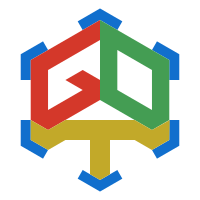

<!-- common contents -->

     
    projectGDT - for a more connected Minecraft world! 
    QQ Group:
    <a href="https://qm.qq.com/cgi-bin/qm/qr?k=jNFTovEpc0WDFtbSbUMrbQ0NyUgDpnCu&jump_from=webapi&authKey=6oBQQeoeB6gA7+AljJK7AV1IUEjkk/HpkvxrBNgAQtpxPtw230h4GQrp56nTw81I">
        162779544
    </a>

---

# gdt-frontend
## 启动方式（dev环境）

1. 在项目根目录下运行 `npm install` 安装依赖（请确保您已在您的电脑正确安装 Node.js 并配置环境变量）
2. 在项目根目录下运行 `npm run dev` 
3. 访问 `http://localhost:3000/` 